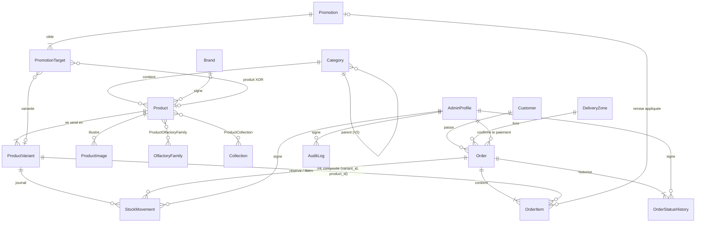

# Modèle de données — Maison Adama

Référence du schéma PostgreSQL (Supabase) : structure, invariants métier et procédures.
Source de vérité : [`prisma/schema.prisma`](../prisma/schema.prisma) (structure) et
[`prisma/migrations/`](../prisma/migrations) (règles).

## Principes

1. **La base garantit les règles métier.** Un bug applicatif produit une erreur, jamais une donnée fausse.
2. **Rien ne se perd.** Commandes, lignes, mouvements de stock, historique des statuts et audit sont immuables.
3. **Tout est signé.** Chaque action admin porte son auteur (`app.admin_id`, voir [`src/lib/db-context.ts`](../src/lib/db-context.ts)).
4. **Montants en entiers FCFA.** Le XOF n'a pas de centimes.
5. **Identifiants UUID v7** générés par la base (`uuid_generate_v7()`), ordonnés dans le temps.

## Diagramme



`StoreSettings` (ligne unique, `id = 1`) et `AuditLog` (toutes tables) complètent le modèle.

## Invariants et où ils sont garantis

Légende : **CHECK** = contrainte de ligne · **FK** = clé étrangère · **UNIQUE** = index unique ·
**TRIG** = trigger immédiat · **COMMIT** = trigger de contrainte différé (vérifié en fin de transaction) ·
**APP** = code applicatif seul.

### Stock

| Invariant | Garantie | Test |
|---|---|---|
| `stock = Σ stock_movements.quantity`, toujours | TRIG `guard_stock_write` : le stock ne change que via `move_stock()` ; une variante naît à 0 | `stock.test.ts` |
| Le stock ne passe jamais sous zéro, même en cas de commandes simultanées | `move_stock()` (UPDATE conditionnel atomique) + CHECK `stock >= 0` | `stock.test.ts` (3 commandes pour 1 flacon) |
| Signe du mouvement cohérent avec son type | CHECK `stock_movements_sign_matches_type` | — |
| VENTE / ANNULATION ⇔ liées à une commande | CHECK `stock_movements_order_iff_sale` | — |
| Ajustement manuel signé par un admin et justifié | CHECK `stock_movements_adjustment_justified` | `stock.test.ts` |
| Une seule sortie et une seule remise en stock par ligne de commande | UNIQUE partiels `stock_movements_one_sale_per_line`, `…_one_release_per_line` | `orders.test.ts` |
| Journal immuable | TRIG `stock_movements_immutable`, `…_no_truncate` | `stock.test.ts` |

### Prix et promotions

| Invariant | Garantie | Test |
|---|---|---|
| Prix payé = prix catalogue au moment de l'achat | TRIG `order_items_check_snapshot` | `orders.test.ts` (prix falsifié) |
| Remise = meilleure promotion automatique en cours, sans cumul | `variant_best_offer()` + TRIG `order_items_check_snapshot` | `orders.test.ts` |
| Remise ⇔ promotion identifiée, avec son nom figé | CHECK `order_items_discount_has_promotion`, `…_promotion_has_name` | — |
| Promotion : valeur > 0, pourcentage ≤ 100, fin > début | CHECK `promotions_*` | — |
| Une cible = un produit XOR une variante | CHECK `promotion_targets_exactly_one_target` | — |
| Arrondi identique en TypeScript et en SQL (demi vers le haut) | `compute-price.ts` ↔ `promotion_discount()` | `compute-price.test.ts` |

### Commandes

| Invariant | Garantie | Test |
|---|---|---|
| `subtotal = Σ prix brut`, `discount_total = Σ remises` | COMMIT `assert_order_integrity` | `orders.test.ts` |
| `total = subtotal − discount_total + delivery_fee` | CHECK `orders_total_consistent` | `orders.test.ts` |
| Au moins une ligne ; une ligne par variante | COMMIT + UNIQUE `(order_id, variant_id)` | `orders.test.ts` |
| La variante d'une ligne appartient bien au produit dénormalisé | FK composite `order_items(variant_id, product_id)` | `orders.test.ts` |
| Chaque ligne a sa réservation de stock exacte | COMMIT `assert_order_integrity` | `orders.test.ts` |
| Annulée ⇔ tout le stock libéré, exactement | COMMIT `assert_order_integrity` | `orders.test.ts` |
| Transitions : EN_ATTENTE → CONFIRMEE → EN_LIVRAISON → LIVREE, annulation depuis EN_ATTENTE / CONFIRMEE | TRIG `orders_guard` (miroir : `status-machine.ts`) | `orders.test.ts`, `status-machine.test.ts` |
| Paiement : NON_PAYE → PAYE → REMBOURSE (+ correction PAYE → NON_PAYE) | TRIG `orders_guard` | `orders.test.ts` |
| Chaque statut a sa date, dans l'ordre chronologique | TRIG (horodatage auto) + CHECK `orders_*_has_date`, `orders_chronology` | `orders.test.ts` |
| Payé ⇒ date + admin qui a constaté l'encaissement | CHECK `orders_paid_is_traced` | `orders.test.ts` |
| Une commande payée ne peut pas être annulée sans remboursement | CHECK `orders_cancelled_not_paid` | `orders.test.ts` |
| Frais différents du tarif de la zone ⇒ justification ; tarif d'origine conservé | CHECK `orders_fee_change_justified` + colonne `default_delivery_fee` | `orders.test.ts` |
| Champs figés (numéro, client, montants, zone, jeton…) | TRIG `orders_guard` | `orders.test.ts` |
| Lignes et historique immuables ; aucune commande supprimée | TRIG `order_items_immutable`, `orders_no_delete`, `order_status_history_immutable` | `orders.test.ts` |
| Historique des statuts complet et signé | TRIG `orders_log_status` | `orders.test.ts` |
| Double envoi du checkout = une seule commande | UNIQUE `idempotency_key` + reprise dans `placeOrder` | `orders.test.ts` |
| Lien de confirmation non devinable | `public_token` (122 bits aléatoires) | `orders.test.ts` |
| Téléphone client au format `+221XXXXXXXXX` | CHECK `customers_phone_format`, `orders_customer_phone_format` + `parseSenegalPhone` | `phone.test.ts`, `orders.test.ts` |

### Catalogue

| Invariant | Garantie | Test |
|---|---|---|
| Produit publié ⇒ au moins une variante active | COMMIT `assert_product_integrity` | `catalog.test.ts` |
| Concentration seulement dans une catégorie qui l'autorise (`has_concentration`) | COMMIT `assert_product_integrity`, `categories_check_concentration` | `catalog.test.ts` |
| Jamais publié ET archivé ; publié ⇒ date de publication | CHECK `products_*` | `catalog.test.ts` |
| Slugs `a-z0-9-` | CHECK `*_slug_format` | `catalog.test.ts` |
| Prix > 0, contenance > 0, une variante par (contenance, unité) | CHECK + UNIQUE | `catalog.test.ts` |

### Traçabilité et sécurité

| Invariant | Garantie | Test |
|---|---|---|
| Toute modification du catalogue, des prix, promotions, zones, paramètres, commandes, clients est auditée (avant / après, auteur) | TRIG `audit_row` | `audit-security.test.ts` |
| Journal d'audit immuable | TRIG `audit_logs_immutable` | `audit-security.test.ts` |
| Un admin désactivé ne peut plus agir | `app_admin_id()` | `orders.test.ts` |
| API Supabase fermée : RLS sur toutes les tables, aucun droit pour `anon` / `authenticated` | Migration `security` | `audit-security.test.ts` |
| Aucune fonction appelable en RPC (`move_stock` y compris) | `REVOKE EXECUTE … FROM PUBLIC` + privilèges par défaut | `audit-security.test.ts` |
| Les futures migrations ne suppriment aucun de ces objets | `npm run db:guard` | Garde-fou (vérifié) |

## Codes d'erreur

Les exceptions SQL portent leur code en préfixe (`[MA001] …`). [`src/lib/db-errors.ts`](../src/lib/db-errors.ts)
les convertit en `DatabaseRuleError` (sous-classe de `DomainError`) :

| SQLSTATE | `code` | Sens |
|---|---|---|
| MA001 | `STOCK_INSUFFICIENT` | Stock insuffisant |
| MA002 | `VARIANT_NOT_FOUND` | Variante inconnue |
| MA010 | `STOCK_WRITE_FORBIDDEN` | Écriture de stock hors `move_stock()` |
| MA020 | `IMMUTABLE` | Donnée figée ou journal immuable |
| MA030 | `INVALID_STATUS_TRANSITION` | Transition de statut interdite |
| MA031 | `INVALID_PAYMENT_TRANSITION` | Transition de paiement interdite |
| MA040 | `ORDER_INCONSISTENT` | Montants ou stock incohérents |
| MA041 | `PRODUCT_UNAVAILABLE` | Produit non publié, archivé ou variante inactive |
| MA042 | `PRICE_CHANGED` | Prix différent du catalogue |
| MA043 | `SNAPSHOT_INVALID` | Snapshot produit / variante / promotion incohérent |
| MA044 | `DISCOUNT_INVALID` | Remise différente de la meilleure promotion |
| MA045 | `ORDER_LOCKED` | Lignes ajoutées à une commande déjà traitée |
| MA050 | `PRODUCT_WITHOUT_ACTIVE_VARIANT` | Produit publié sans variante active |
| MA051 | `CONCENTRATION_NOT_ALLOWED` | Concentration hors catégorie autorisée |
| MA060 | `ADMIN_INACTIVE` | Administrateur inconnu ou désactivé |

## Utilisation depuis le code

```ts
// Action admin : toujours dans withAdmin (signature en base)
await withAdmin(adminId, (tx) => tx.productVariant.update({ where: { id }, data: { price: 27000 } }));

// Stock : uniquement via moveStock / restock / adjustStock
await restock(adminId, { variantId, quantity: 12, note: 'Livraison fournisseur' });

// Recherche sans accents (utilise l'index products_search_trgm_idx)
await prisma.$queryRaw`
  SELECT id, name FROM products
   WHERE is_published AND NOT is_archived
     AND product_search_text(name, search_keywords) LIKE '%' || normalize_search(${q}) || '%'`;
```

## Procédures

### Première installation (Supabase)

```bash
npm run db:deploy          # garde-fou + applique les 5 migrations
npm run db:seed            # référentiels (SEED_DEMO=1 pour des produits de démonstration)
```

### Faire évoluer le schéma

1. Modifier `prisma/schema.prisma`.
2. `npm run db:migrate -- --name ma_modif` : crée la migration **sans l'appliquer** (`--create-only`),
   puis lance le garde-fou. Nécessite `SHADOW_DATABASE_URL`, un second projet Supabase.
3. Si le garde-fou signale un `DROP INDEX` visant un index partiel ou d'expression, c'est Prisma qui ne le
   connaît pas : supprimer la ligne.
4. Toute nouvelle table : ajouter `ALTER TABLE … ENABLE ROW LEVEL SECURITY;` dans la migration (le garde-fou l'exige).
5. Ajouter les CHECK, triggers et tests correspondants, puis mettre à jour ce document.

### Tests

```bash
npm test                   # unitaires ; + intégration si TEST_DATABASE_URL est défini
npm run test:db            # intégration seule
```

`TEST_DATABASE_URL` doit désigner un projet Supabase **dédié aux tests**, en connexion directe (port 5432).
Il est entièrement réinitialisé à chaque exécution. Le setup refuse de démarrer s'il désigne la base principale.

### Surveillance

```sql
SELECT * FROM stock_ledger_discrepancies();   -- doit renvoyer 0 ligne
```

## Décisions et limites connues

- **Numéros de commande** : compteur global (`CMD-2027-00458` en 2027). Il peut y avoir des trous
  si une commande échoue, ce qui est normal pour une séquence PostgreSQL.
- **Admins** : jamais supprimés s'ils ont un historique (FK `RESTRICT`). On passe `is_active = false`
  et on bannit l'utilisateur dans Supabase Auth.
- **Promotions utilisées** : jamais supprimées (FK `RESTRICT` depuis `order_items`). On les désactive.
- **Codes promo (V2)** : les promotions avec `code` sont exclues du calcul automatique ; leur logique
  reste à écrire.
- **Contournement volontaire** : un rôle propriétaire peut toujours désactiver un trigger. Les garanties
  visent les bugs et les erreurs de manipulation, pas un administrateur de base malveillant.
- **Trigger d'événement « RLS auto »** : créé sur Supabase (autorisé par supautils). Toute table créée
  ensuite dans `public` reçoit la RLS ; le garde-fou de migrations l'exige de toute façon.
- **Droits par défaut** : `ALTER DEFAULT PRIVILEGES IN SCHEMA …` ne peut qu'ajouter des droits ; retirer
  l'EXECUTE global de PUBLIC exige la forme sans `IN SCHEMA` (migration 6).
